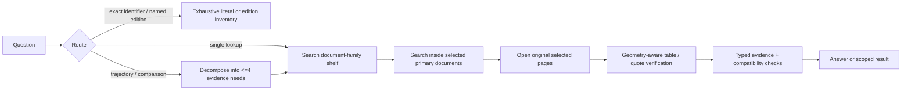

# Retrieval-lab research: a path to a working evidence system

> **Superseded recommendation — 2026-09-13.** The proposed Shelf V2 build is no longer the
> next action. Subsequent review confirmed that Approach C had already measured the central
> shelf, BGE semantic-vector, and lexical-plus-semantic RRF route, and it failed the offline
> discovery gate. See
> [`REPORT/08_what_next/CORRECTION_2026-09-13.md`](REPORT/08_what_next/CORRECTION_2026-09-13.md).
> The research body below is retained unchanged as the historical recommendation made before
> that correction.

## Decision

No stack in this repository has yet demonstrated the required result: a correct, opened,
cited source page for vague questions, plus a defensible scoped negative when supporting
material is absent. The recommended next build is **Shelf V2**: a document-family router,
strict table/navigation cards, bounded question decomposition, in-document retrieval, and
selected-page evidence verification.

It should reuse the reliable parts of `evidence_v1` (inventory, content identity,
provenance records, evidence compiler, install/teardown, tests) and replace its global
card representation. Do not restart with a new vector database or a full-page embedding
index.

## What the repository proves

| Finding | Evidence | Meaning |
|---|---|---|
| Extraction and coverage are healthy | `INDEX.md`; `corpus-lab/05_findings/NIGHT2_FULL_REPORT.md` | The harness has 15,010 files; 13,634 are text-indexed across 1,206,260 pages. The primary failure is not a missing FTS index. |
| Page-level lexical ranking fails on real questions | `corpus-lab/state/rank_experiments.json` | Eight lexical query strategies returned the evidence file in the global top-50 for 0/17 answerable frozen questions. |
| Agent behaviour is a second failure | `corpus-lab/05_findings/FINDINGS_LIVE.md`, F20-F24 | S1 surfaced a right document on 5/17 questions, but the agent opened none of them and sometimes cited snippets as if they were evidence. |
| Similarity score cannot decide absence | `corpus-lab/state/probe_score_floor.json` | Answerable and absence questions overlap. A score floor cannot support a refusal policy. |
| Full page embeddings do not fit setup constraints | `INDEX.md`; `plans_fable/B_HYBRID_MULTIQUERY_PLAN.md` | `bge-small` measured about 7-8 pages/s: tens of hours for the harness, on a CPU-only Windows machine. |
| Astra/evidence_v1 is real but failed its free retrieval gate | `corpus-lab/state/evidence_v1/20260912T220732Z-cede10c8/STOP_REASON.md` | Its top-24 hit rate was 3/17. The failure is informative and must not be described as a failed end-to-end product. |

## The Astra/evidence_v1 failure, correctly interpreted

The Astra plan in `SOLUTION.md` / `BUILD_PROMPT.md` is valuable infrastructure, not a
successful retriever. Its build passed integrity, inventory, extraction, compiler, hook,
and install/teardown stages with no corpus changes and no paid sessions. Its retrieval
stage stopped correctly.

The decisive representation defect is mechanical: **1,111,638 of 1,201,574 cards
(92.5%)** came from the captionless-table heuristic. Ordinary prose containing two years
and two numbers was indexed as a table. The supposedly small, high-signal table catalogue
therefore became almost the same size as the failing page index. The protocol also used a
single bag-of-words query even though seven of the 17 positives require several sources.
It cannot establish that structured retrieval is ineffective.

Keep these parts: transaction-safe inventory and hashes; source/page/cell provenance;
typed evidence and Decimal calculations; compatibility checks; receipts; safe stack
installation; and the existing test suite. Replace only the global discovery layer.

## Prior solutions and their standing

| Path | Status | Keep / change |
|---|---|---|
| S0 stock search | Measured. Good at planted exact strings, poor on questions. | Keep only as a fallback and comparison baseline. |
| S1 FTS5 + policy | Measured. Cheap and fully adopted, but cannot rank global pages. | Retain FTS5 for document cards and inside-document search. |
| S2 enforced FTS5 | Measured. No demonstrated advantage over policy, removes fallback. | Do not lead with blocking hooks. Add lightweight output verification after the retrieval route works. |
| Fable B hybrid multi-query | Planned, not built. | Retain multi-query/RRF/reranker only over a small card pool; reject the proposed full-page vector route. |
| Fable C shelf-first | Planned, not built. | This is the correct structural foundation. Strengthen it with strict cards, routing, duplicate families, and cell verification. |
| Astra evidence_v1 | Built; offline gate failed 3/17. | Reuse its trustworthy runtime pieces; replace the polluted card catalogue and invalid one-query gate. |
| Full-page dense/late interaction/visual search | Not viable here. | Reject as default: no NVIDIA GPU and CPU build budget is unacceptable. |
| Elasticsearch, Qdrant, Windows Search | Technically possible in some configurations. | Reject for v1: a server or search-engine swap does not repair candidate representation, table structure, or multi-source routing. |
| Bulk OCR | Unmeasured and inherently uncertain for numeric tables. | Treat as a sampled, opt-in coverage extension only. |

## Recommended design: Shelf V2

### 1. The shelf

Build exactly one **document card** for every readable document, not one inferred table
per page. Its deterministic fields are title/front-page heading, normalized publication
family, fiscal years detected in front matter, page count, content hash, paths, first-page
text, contents/list-of-tables text, and explicit `Table`/`Exhibit` caption lines.

Create a separate strict navigation/table-card set only from:

1. explicit numbered captions;
2. contents or list-of-tables entries;
3. native CSV/XLSX/DOCX table structures; or
4. a PDF page on which table geometry is confirmed.

The old rule based only on years and numerical cells is prohibited unless an independent
precision sample reaches the gate below. Attach context to every card:
`publication | family | fiscal year | source path | section/contents heading | caption | row or page text`.
This is a deterministic, local form of contextual retrieval.

Exact hashes collapse copies. Near copies remain visible but are clustered by normalized
title, fiscal year, first-page/contents token similarity, and caption-set similarity. The
largest complete item is marked primary; nothing is silently discarded.

### 2. Query routing and bounded retrieval

Route before global search:

* **exact** — report number, SRO, series ID, DOI, or literal phrase: exhaustive normalized
  phrase search; never use semantic score as a negative.
* **edition** — named publication + FY: search shelf and return `EDITION_PRESENT` or
  `NO_EDITION_FOR`, including nearby editions and unreadable matching files.
* **series** — “since”, “trajectory”, “first half vs last half”, or “across years”:
  select a family, enumerate relevant primary editions, then search each document.
* **comparison / multi-branch** — decompose into at most four atomic evidence needs;
  each gets a documented independent search. Merge evidence only after scope/unit checks.
* **single lookup** — shelf -> strict caption/page -> original-page verification.

Search document cards with field-weighted FTS5 first (title/family 4, contents/captions 3,
front matter 1). Search the top 8 families' primary documents with in-document FTS5. The
global page index remains a fallback, never the primary path. Limit results to three pages
per document and 24 opened candidate pages per question.

### 3. Conditional semantic and reranking layers

After a shelf-only offline gate passes, benchmark a static CPU embedding model on only
document and strict-navigation cards (roughly 15k-100k records), not raw pages. A
Model2Vec/static-retrieval model is a candidate because it is designed for CPU static
embeddings, but its vendor speed claims are not accepted without a local benchmark.

Fuse top-100 lexical and top-100 semantic cards with RRF (`k=60`). Rerank only the fused
top 50-100 cards/pages with a compact ONNX cross-encoder. Do not add either layer if it
fails to improve the defined offline gate: a reranker cannot rescue omitted evidence.

### 4. Evidence verification and answer policy

Open every cited original page. On selected text PDFs, use PyMuPDF `find_tables()` or
pdfplumber/PDFium geometry to identify a candidate table region. A numeric claim needs an
address containing source hash, path, physical page, rendered crop/bounding box, row label,
full column/header path, literal value, unit, period, and source line/caption. A value with
an ambiguous row, header, or unit becomes `AMBIGUOUS_EXTRACTION`, not an answer.

The answer compiler may calculate only from compatible evidence records. It must emit one
of `ANSWER`, `PARTIAL`, `CONFLICT`, `NOT_FOUND_IN_SEARCHED_MATERIAL`,
`UNAVAILABLE_COVERAGE`, `AMBIGUOUS_EXTRACTION`, `INDEX_PENDING`, or `ENGINE_ERROR`.
For semantic questions, the negative is limited to the searched, current readable coverage.

## Evidence from outside the repository

These sources support the mechanism, not a promise of performance on this corpus:

* [Dense Hierarchical Retrieval](https://aclanthology.org/2021.findings-emnlp.19.pdf)
  reports that document-first filtering followed by passage ranking can remove distracting
  documents, and that reranking improves only after such retrieval.
* [Anthropic Contextual Retrieval](https://www.anthropic.com/engineering/contextual-retrieval)
  explains why document/year/source context should be prepended before both BM25 and
  embeddings, and recommends evaluating each layer.
* [Sentence Transformers retrieve-then-rerank guidance](https://www.sbert.net/examples/sentence_transformer/applications/retrieve_rerank/README.html)
  describes the standard role of a cross-encoder: reorder a small candidate set, not a
  whole corpus.
* [Question Decomposition for RAG](https://arxiv.org/abs/2507.00355) supports retrieving
  per sub-question and merging evidence for multi-hop questions; it directly explains why
  Astra's one-query protocol is mismatched to the fixture's trajectories and comparisons.
* [PyMuPDF table API](https://pymupdf.readthedocs.io/en/latest/page.html) exposes local
  line/text-based table detection. [Camelot](https://camelot-py.readthedocs.io/en/stable/)
  confirms that text-PDF table extraction does not handle scans, so neither is an OCR cure.
* [Model2Vec](https://github.com/MinishLab/model2vec) provides a lightweight static-CPU
  candidate; [Hugging Face's static-embedding benchmark](https://github.com/huggingface/blog/blob/main/static-embeddings.md)
  cautions that speed and retrieval quality must be measured locally.
* [RAGAS context recall](https://github.com/vibrantlabsai/ragas/blob/main/docs/concepts/metrics/available_metrics/context_recall.md)
  and [citation-faithfulness research](https://arxiv.org/abs/2412.18004) support measuring
  retrieval, claim support, and citations separately.

## Explicit rejections and risks

* Do not use a relevance threshold for absence; the repository disproved it.
* Do not use Claude-generated query text as evidence; it may only generate search terms.
* Do not run OCR or structure models over all files until a stratified page sample proves
  time, text, table, and numeric-cell quality.
* Do not let a model cite a search snippet. It must cite an opened page/cell record.
* Do not make a complete-document or official-source claim from a filename. Preserve copies
  and report conflict.
* Do not grade an intended multi-search route with one global query. Measure the bounded
  loop that will actually run in production.

`EXECUTE_SHELF_V2.md` is the build and experiment contract.
